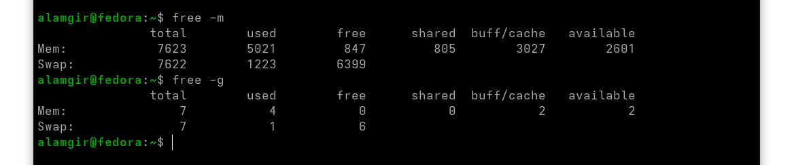

# Random Access Memory (RAM)

* Installed in **slots on the motherboard**.
* Stores **running programs and active data**.

### Architecture Limits

* **32-bit systems** → up to **4 GB RAM**
* **64-bit systems** → can use **much more RAM**

### How RAM Works

* Programs load into RAM when running.
* CPU executes instructions from RAM.
* Faster than disk storage.

### Swap (Virtual Memory)

* Used when **RAM is low**.
* Inactive data is moved from RAM to **disk (swap space)**.
* Automatically managed by the system.
* Slower than RAM but prevents crashes.

### Check Memory Usage

* `free -m` → shows RAM & swap in **MB**
* `free -g` → shows RAM & swap in **GB**

