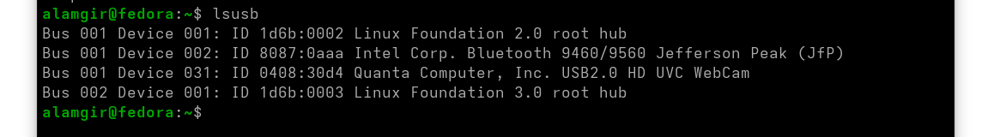

# Buses

* A **bus** is a high-speed connection for communication.
* Connects **CPU, RAM, and other components**.
* Located on the **motherboard**.

### Common Bus Types

* **PCI (Peripheral Component Interconnect)**
  * Used for internal devices (network, video, storage cards).
* **USB (Universal Serial Bus)**
  * Used for external devices (keyboard, mouse, printer, storage).

### Desktop / Server Systems

* CPU and RAM attached directly to motherboard.
* Expansion cards connect via **PCI slots**.
* Devices can be **upgraded or replaced**.

### Laptop / Small Form Factor Systems

* Most components are **built into the motherboard**.
* Bus still exists but **upgrades are limited**.

### Peripheral Devices

* Devices for **input, output, or storage**.
* Examples: keyboard, mouse, monitor, printer, hard disk.

### View PCI Devices

* Command: `lspci`
* Shows video, storage, and network controllers.

### USB(Universel Serial Bus) Devices

* External peripherals use **USB bus**.
* **Hot-plug** supported (no shutdown required).
* Always **unmount storage** before removal.

 **View USB Devices** :  `lsusb`
  Lists all connected USB devices.

