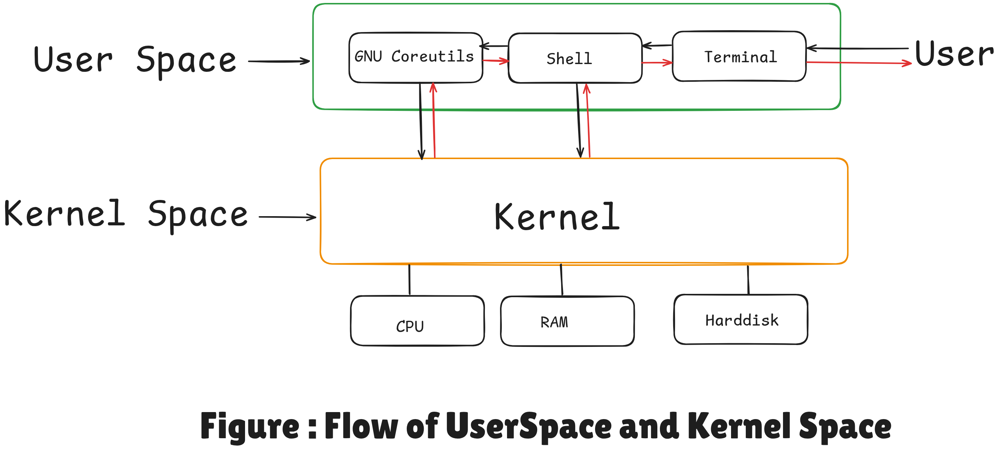

# **Complete Linux Operating System**

>Linux means the kernel of the system, which is the central controller of everything that happens on the computer.

A Linux OS is a complete system composed of:

1. **Linux Kernel**

   * The core of the operating system responsible for process management, memory management, hardware interaction, and system calls.

2. **Desktop Environment**

   - Provides a graphical interface for users.
   - Examples: **GNOME**, **KDE**
   - Components include:
      * Terminal
      * Taskbar
      * File manager

3. **GNU Utilities**

   * Developed by the **Free Software Foundation (FSF)** under **Richard Stallman (1983)**.
   * GNU is **not UNIX**, but provides similar functionality.
   * Key components:
      - **GNU Compiler Collection (GCC)** – Compiles C, C++, and other programs.
      - **GNU C Library (glibc)** – Provides standard functions like `printf`, `scanf`, `free`, `read`, `strcmp`, `exit`.
      - **GNU Core Utilities** – Basic commands like `ls`, `cd`, `cp`, `mv`.
      - **GNU Bash** – Default command-line shell.
      - **GNU Debugger (GDB)** – Debugging programs.

4. **Package Manager**

   * Tool to install, update, and remove software packages.
   * Examples: `apt` (Debian/Ubuntu), `yum` (CentOS), `dnf` (Fedora), `pacman` (Arch Linux).

5. **Init Systems**

   * Manage system startup and services.
   * Examples: **systemd**, **SysVinit**, **Upstart**.

6. **Other Tools and Configuration**
   * Various utilities, configuration files, and services needed for system functionality.

  

