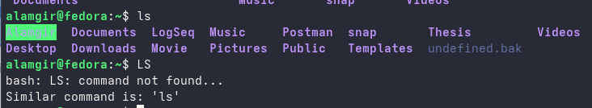

# Navigating Basic Command Syntax

Most commands follow a simple pattern of syntax:
`command [options…] [arguments…]`

>Consider This
Every part of the command is normally case-sensitive, so LS is incorrect and will fail, but ls is correct and will execute.

>Command is a software program that, when executed on the CLI, performs an action on the computer.