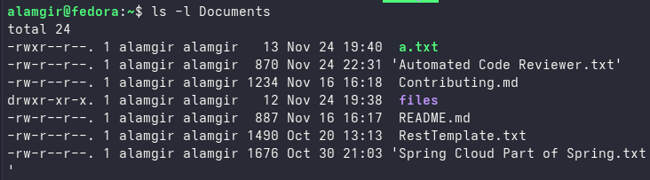

# Options vs Arguments 

* **Options** → Change how a command works (start with `-` or `--`)
* **Arguments** → Specify **what** the command works on (files, folders, etc.)

**Format:**`command [options] [arguments]`

| Command Example          | Command | Option | Argument(s)          | Meaning                         |
| ------------------------ | ------- | ------ | -------------------- | ------------------------------- |
| `ls -l Documents`        | ls      | -l     | Documents            | Show detailed list of Documents |
| `rm -r test`             | rm      | -r     | test                 | Delete the test folder          |

