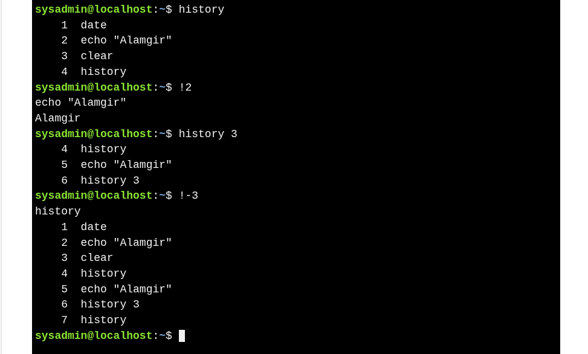

# History
>When a command runs in the terminal, it’s saved in the **history list**, allowing you to quickly reuse commands without retyping them.

Basic Usage
```bash
↑        # Show previous command
↓        # Move forward in history
← / →    # Move cursor to edit command
history  # Show full command history
```

```bash
history       # Show full command history
!3            # Run a command by its history number
history 3     # Show last 3 commands
!-3           # Run the 3rd command from the bottom
!!            # Run the most recent command
!ls           # Run the most recent 'ls' command
```

