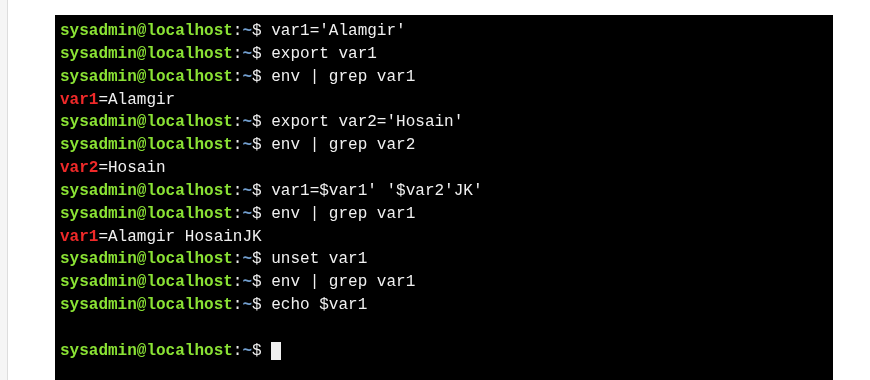

# Variables

>Variables store data for the shell or user.


There are two types of variables used in the Bash shell:
* **Local** – Only in current session
* **Environment** – Available to shell and child processes

## 1. Local variables

* Local vars exist **only in current shell**
* They **do not affect other commands or applications**.
* **Lost** when terminal closes
* Commonly used for **user tasks** and written in **lowercase**.
* Set a variable using: `variable=value` (creates or updates it).


## 2. Environment variable


* **Available system-wide** (all shells)
* **Automatically recreated** when a new shell opens
* Common examples: **`PATH`**, **`HOME`**, **`HISTSIZE`**

Example: 
 - **Export a local variable → environment variable** : `export var1` → makes it global
 - **Create + export in one line** : `export var2='Hosain'` 
 - **Combine values of variables** : `var1=$var1' '$var2 'JK'`
- **Remove an environment variable**  : `unset var1`




---
##  Path Variables

* PATH = directories where shell looks for commands
* Directories separated by `:`
* If command not in PATH → `command not found` error
* Always append `$PATH` to prevent losing old paths


Example 

```
[COMMAND] > [FILE]       # structure
echo $PATH               # Show current PATH
PATH=/video/movie:$PATH  # Add /video/movie to PATH
echo $PATH               # Verify update
```

