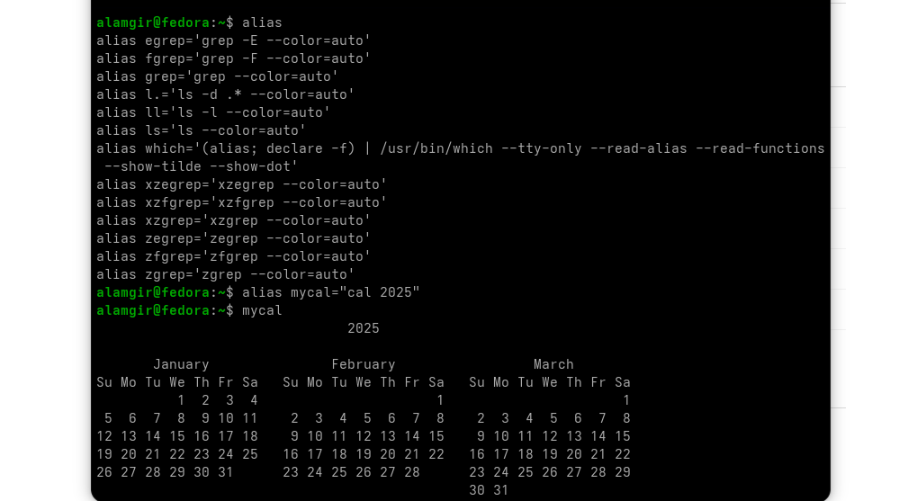

#  Command Types

* Commands in the shell come from **different sources**.
* Use the `type` command to check **where a command comes from**.
**Example** ` type command_name`  ; tells whether it is **internal**, **external**, **alias**, or **function**


##  Command Sources

## 1.  Internal Commands 
Key Points

* Internal commands = **built into the Bash shell**.
*  **do NOT require** starting a separate program.
* Shell already knows how to run them.
* Bash executes it directly.
* use `type` to check a check is internal.
* Example: `cd`, `echo`, `pwd`, `history`

**Example:** `type cd`
**Output:** cd is a shell builtin


##  2. External Commands

* Stored outside the shell (not built-in).
* Shell searches **$PATH** to find them.
* Can run them using **full path**.


####  Useful Commands & Examples

| Purpose                               | Command        | Output / Meaning              |
| ------------------------------------- | -------------- | ----------------------------- |
| Find full path of a command           | `which ls`     | `/bin/ls`                     |
| Check full path for another command   | `which cal`    | `/usr/bin/cal`                |
| Run command using full path           | `/bin/ls`      | Executes `ls` directly        |
| Show how shell interprets the command | `type cal`     | `cal is /usr/bin/cal`         |
| Difference (builtin vs external)      | `type echo`    | `echo is a shell builtin`     |
|                                       | `which echo`   | `/bin/echo`                   |
| Show all locations of a command       | `type -a echo` | Shows builtin + external path |


## 3. Aliases

* Map a longer commands to shorter sequences.
* Shell substitutes alias with full command before execution.
* Each shell has its own aliases; new shells don’t inherit them.
* View current aliases: `alias`
* Create new alias: `alias name="command"`
* Identify aliases : `type`




## 4. Functions

* Combine multiple commands into a single callable unit.
* Can create new commands or override existing ones.
* Usually defined in shell scripts or initialization files.
* Execute the function by typing its name.

Syntax:

  ```bash
  function_name () {
      commands
  }
  ```


---

>* **Internal commands** – Built into the shell
>* **External commands** – Stored as files in system directories
>* **Aliases** – Custom shortcuts for commands
>* **Functions** – User-defined command blocks inside the shell


