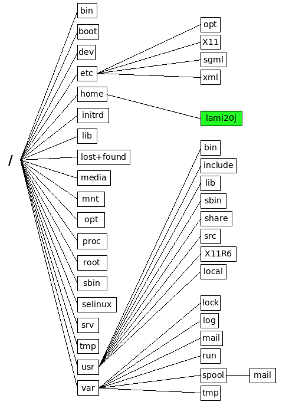

# Linux Directory Structure
---

### **1. Temporary & Volatile Directories**

| Directory  | Description                                       | Example/Use            |
| ---------- | ------------------------------------------------- | ---------------------- |
| `/tmp`     | Temporary files, cleared on reboot                | `/tmp/session.tmp`     |
| `/var/tmp` | Temporary files preserved across reboots          | `/var/tmp/install.log` |
| `/run`     | Holds runtime data for processes.              | `/run/nginx.pid`       |
| `/var/run` | Older path for runtime info (symlinked to `/run`) | `/var/run/sshd.pid`    |

### **2. User & Application-Specific Directories**

| Directory | Description                                 | Example/Use                          |
| --------- | ------------------------------------------- | ------------------------------------ |
| `/home`   | Home directories for users                  | `/home/alice`, `/home/bob`           |
| `/root`   | Home directory of the root user             | `/root`                              |
| `/opt`    | Optional software packages                  | `/opt/eclipse`                       |
| `/usr`    | User programs, libraries, and documentation | `/usr/bin`, `/usr/lib`, `/usr/share` |
| `/srv`    | Data for services (web, FTP)                | `/srv/www`, `/srv/ftp`               |

### **3. Important System Directories**

| Directory | Description                                      | Example/Use                   |
| --------- | ------------------------------------------------ | ----------------------------- |
| `/`       | Root directory, starting point of the filesystem | `/bin`, `/etc`, `/home`       |
| `/bin`    | Essential user binaries                          | `ls`, `cp`, `mv`              |
| `/sbin`   | System binaries for admin/root                   | `ifconfig`, `shutdown`        |
| `/lib`    | Shared libraries for binaries                    | `/lib/libc.so.6`              |
| `/etc`    |Store System configuration files                       | `/etc/passwd`, `/etc/hosts`   |
| `/boot`   | Bootloader and kernel files                      | `/boot/vmlinuz`, `/boot/grub` |

### **4. Device & Virtual Filesystems**

| Directory | Description                                      | Example/Use                      |
| --------- | ------------------------------------------------ | -------------------------------- |
| `/dev`    | Device files representing hardware               | `/dev/sda`, `/dev/tty`           |
| `/proc`   | Virtual filesystem for processes and system info | `/proc/cpuinfo`, `/proc/meminfo` |
| `/sys`    | Kernel and system info                           | `/sys/class/net/eth0`            |

### **5. Mount Points**

| Directory | Description                      | Example/Use              |
| --------- | -------------------------------- | ------------------------ |
| `/mnt`    | Temporary mount points           | `/mnt/usb`, `/mnt/disk1` |
| `/media`  | Mount points for removable media | `/media/usbdrive`        |

