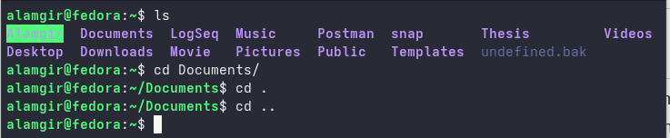

# Changing Directory

| Command / Symbol | Meaning / Use                               | Example                                           |
| ---------------- | ------------------------------------------- | ------------------------------------------------- |
| `cd`             | Change directory                            | `cd Documents` → move to Documents folder         |
| `..`             | Move to **parent directory** (one level up) | `cd ..` → go up one folder                        |
| `.`              | Refers to **current directory**             |  javac HelloWorld.java → compile HelloWorld.java in the current folder

