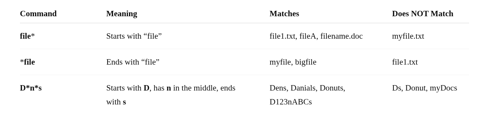

#  Globbing

* Globbing uses wildcard characters to match filename patterns.
* Shell expands them **before** running the command.
* Allow work with **many files at once**.
* Works with **any command** (`ls`, `rm`, `cp`, `mv`, etc.).


## 1. Asterisk `*` 

* Matches **zero or more** characters.
* Useful to select many files with similar names.

**Example:**

```bash
echo file*
```
Matches: `file`, `file1`, `fileA.txt`, `file_test.doc` (anything starting with **file**).





## 2. Question Mark `?` 

* Matches **exactly one** character (not zero, not more).
* Each `?` stands for one unknown character.

**Example:**

```bash
echo file?.txt
```

Matches: `file1.txt`, `fileA.txt`, `fileX.txt`
Does **not** match: `file10.txt` (because that's two characters)


| Pattern       | Meaning                                        | Matches Example | Not Match Example |
| ------------- | ---------------------------------------------- | --------------- | ----------------- |
| **??????**    | Exactly **6 characters**                       | abc123          | abcd (4 chars)    |
| **D????????** | Starts with **D** + **7 more chars** (8 total) | Dabc1234        | Abc12345 (no D start)          |
| **?????*s**   | At least **5 chars**, ends with **s**          | apples, books   | apple (no s)      |


## 3. Brackets `[ ]` 

* Matches **any one character** inside the brackets.
* Can specify ranges, e.g., `[a-z]` or `[0-9]` or `[0123]`

**Example:**

```bash
echo file[1-3].txt
```

Matches: `file1.txt`, `file2.txt`, `file3.txt`
Does **not** match: `file4.txt`

## 4. Exclamation Point `!`

* Used inside brackets `[ ]` to **negate a range**.
* Matches any character **not listed** in the brackets.

**Example:**

```bash
echo file[!1-3].txt
```

Matches: `file4.txt`, `file5.txt`, etc.
Does **not** match: `file1.txt`, `file2.txt`, `file3.txt`

---


| Pattern     | Meaning                                   | Matches Example   | Not Match Example |
| ----------- | ----------------------------------------- | ----------------- | ----------------- |
| **[DP]***   | Starts with **D** or **P**                | Data, Paper, Desk | Cat, Apple        |
| **[!DP]***  | Starts with **anything except D or P**    | Cat, Apple, Ball  | Data, Page        |
| **[D-P]***  | Starts with any letter **D to P (range)** | Desk, House, Note | Apple, Zebra      |
| **[!D-P]*** | Starts with any character **outside D–P** | Apple, Zebra, cat | Desk, Game        |


---
### Listing With Globs

* The **shell expands glob patterns** before `ls` runs.
* **Problem**: Using `ls` with globs shows contents of directories, which can be confusing.
* **Solution**: Use `-d` option to list directory names instead of contents.

**Example:**

```bash
ls /etc/x*      # lists contents of matching directories
ls -d /etc/x*   # lists directory names only
```
