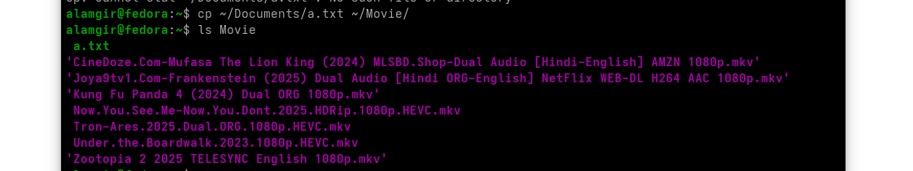

# Copying Files – cp Command

cp  Command Structure : `cp [OPTIONS] SOURCE DESTINATION`





| Option       | Meaning                                     | Example                         |
| ------------ | ------------------------------------------- | ------------------------------- |
| `-v`         | Verbose — shows what is being copied        | `cp -v a.txt backup/`           |
| `-i`         | Interactive — ask before overwrite          | `cp -i report.txt /tmp/`        |
| `-r` or `-R` | Recursive — copy directories                | `cp -r Project/ BackupProject/` |
| `-f`         | Force overwrite without asking              | `cp -f data.csv /tmp/`          |
| `-p`         | Preserve permissions, ownership, timestamps | `cp -p script.sh /backup/`      |


---

# **Copying Files – `dd` Command**

The **`dd`** command is used to copy data **bit-by-bit**. It can copy:

* Files
* Disks
* Partitions
* ISO images
* Bootable media

It is more powerful (and dangerous) than `cp` because it writes **raw data**.


Structure: 

```bash
dd [OPTIONS] OPERAND #Command Structure
dd if=SOURCE of=DESTINATION [options] #Common Structure
```


### **Common Options**

| Option    | Meaning                                    |
| --------- | ------------------------------------------ |
| `if=`     | Input file (source)                        |
| `of=`     | Output file (destination)                  |
| `bs=`     | Block size (amount of data copied at once) |
| `count=`  | Number of blocks to copy                   |
| `status=` | Show progress (e.g., `status=progress`)    |

Example:
```bash
dd if=file1.txt of=file2.txt                             # Copy a file block-by-block
sudo dd if=linux.iso of=/dev/sdb bs=4M status=progress   # Create a bootable USB from ISO
sudo dd if=/dev/sda of=/backup/sda.img status=progress   # Backup an entire disk
dd if=/dev/zero of=emptyfile.bin bs=1M count=10          # Create a 10 MB file filled with zeros
dd if=/dev/zero of=/tmp/swapex bs=1M count=50           # Create a 50 MB swap file
```


---
## Important: Permissions Needed for Copying

To successfully copy a file:
### **Permissions Required**
* Must have **write (w)** and **execute (x)** permissions on:

  * The **source directory**
  * The **destination directory**


 usually have the needed permissions in:

* **home directory (`~/`)**
* **Temporary directory (`/tmp`)**
