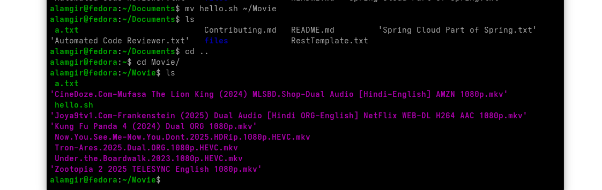

# **Moving Files (`mv` Command)**

The `mv` command is used to **move or rename files**.


Command Structure : `mv SOURCE DESTINATION`




## **Notes**

* Moving a file to the same directory → **renames the file**
* Moving files across directories → **retains content and original name** unless explicitly renamed

Example: 

```bash
mv people.csv Here/                          # Move a file to another directory
mv numbers.txt letters.txt alpha.txt Here/   # Move multiple files to a directory
mv animals.txt zoo.txt                        # Rename a file in the same directory
mv hello.sh ~/Documents/Here/                 # Move a file to another folder using full path
mv *.txt Here/                              # Move all .txt files to the Here directory
```

---
## **Permissions Required**

* Must have **write (w)** and **execute (x)** permissions on:

  * The **source directory**
  * The **destination directory**

