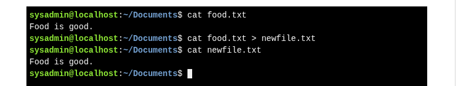
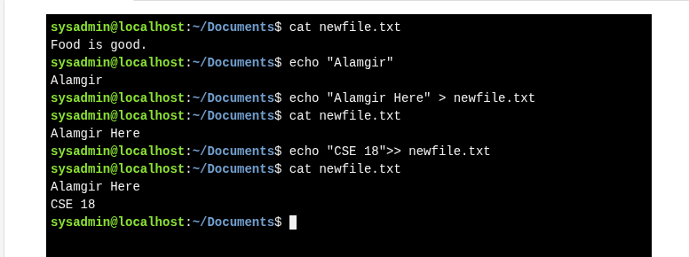
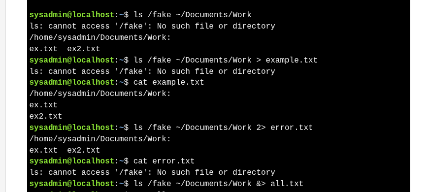
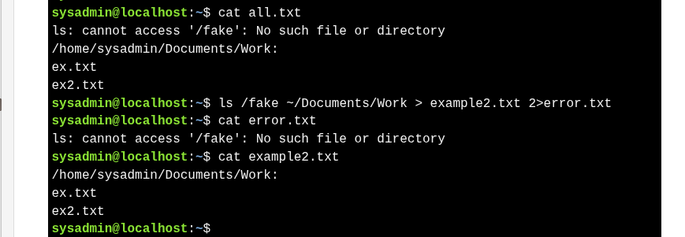
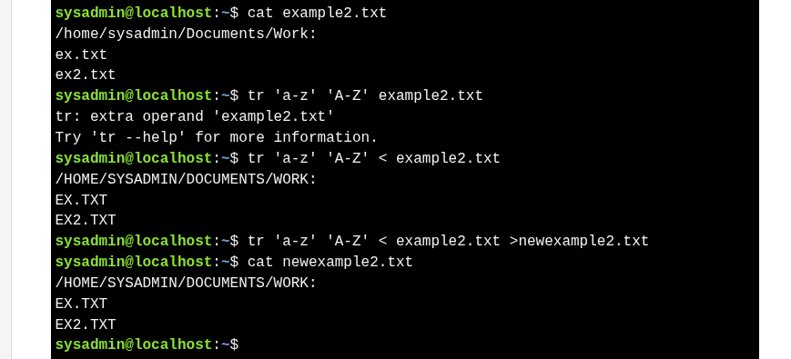

# **Redirection**

Redirection allows command output (STDOUT) to be sent to files instead of the terminal.

**File Descriptors:**

| Descriptor      | Abbreviation | Meaning                          |
| --------------- | ------------ | -------------------------------- |
| Standard Input  | STDIN        | Input to a command (keyboard)    |
| Standard Output | STDOUT       | Normal command output (terminal) |
| Standard Error  | STDERR       | Error messages                   |


---
## 1. STDOUT
```bash
[COMMAND] > [FILE]  # Redirect STDOUT to a file (overwrites content)
[COMMAND] >> [FILE] # Append STDOUT to a file
```


 **Example: Redirecting cat Output**



**Example: Using echo with Redirection**




>**Important:**
>* Using `>` **overwrites** existing file content.
>* Using `>>` **appends** to existing file content.
>* User must have **write permissions** on the file to redirect content.


## 2. STDERR 

* **STDERR = stream 2** (error messages).
* `>` redirects **STDOUT (1)** by default.
* Use `2>` to redirect **STDERR**.

**Examples:**

```bash
ls /fake                  # error shown on terminal (STDERR)
ls /fake > output.txt     # error still shown (not STDOUT)
ls /fake 2> error.txt     # error saved to file
cat error.txt             # view error message
```

---
##  Redirecting Multiple Streams 

>Commands can produce **STDOUT** and **STDERR** together.

* `>`  : redirects **STDOUT only**.
* `2>` : redirects **STDERR only**.
* `&>`  : redirects **both STDOUT and STDERR** to the same file.
    * With `&>` :  **errors appear first**, then normal output.
* Use `> file 2> file` to send outputs to **separate files**.
* The **order of redirections does not matter**.

**Examples:**

```bash
ls /fake /etc/ppp > out.txt        # only STDOUT to file
ls /fake /etc/ppp 2> err.txt       # only STDERR to file
ls /fake /etc/ppp &> all.txt       # both to same file
ls /fake /etc/ppp > out.txt 2> err.txt  # split output
```





##  3. STDIN 


* **STDIN** is input, usually from the **keyboard**.
* Rarely redirected; useful when commands **don’t take filenames**
* Commands like `cat`, `tr` read from STDIN by default
* `<` :  reads input from a file
* `<` and `>` :  together read from one file, write to another


**Examples:**

```bash
cat > new.txt                        # take keyboard input, save to file
tr 'a-z' 'A-Z' < file.txt            # read input from file
tr 'a-z' 'A-Z' < file.txt > out.txt  # read from file, save output
```

