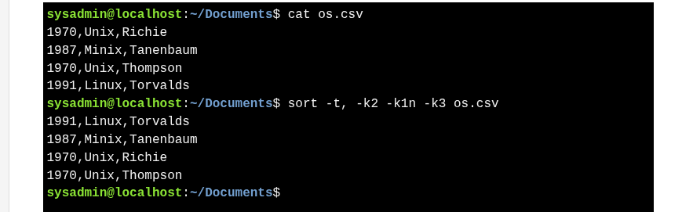

# sort : Fields & options 

* **Fields** are separated by a **delimiter** (default: space/tab).
    * **`-tX`** → set delimiter (e.g., `-t:` or `-t,`)
    * **`-kN`** → sort by field number **N**
    * **`-n`** → numeric sort
    * **`-r`** → reverse order
* Multiple **`-k`** options = primary, secondary sorts

**Examples**

```bash
sort -t: -k3 -n mypasswd      # Sort 3rd field numerically (colon-delimited)
sort -t: -k3 -n -r mypasswd   #  Reverse numeric sort
sort -t, -k2 -k1n -k3 os.csv  #  Multi-field sort 
```



| Option | Function                                   |
| ------ | ------------------------------------------ |
| -t,    | Specifies the comma as the field delimiter |
| -k2    | Sort by field #2                           |
| -k1n   | Numerically sort by field #1               |
| -k3    | Sort by field #3                           |
