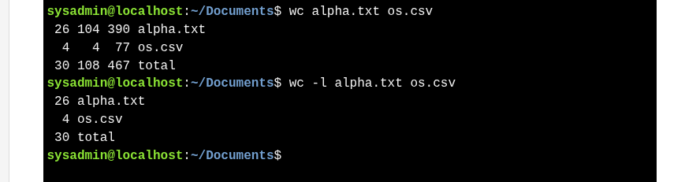

# Viewing File Statistics -  `wc` command
* `wc` counts **lines, words, and bytes** in a file.
* Default output has **four columns**: lines, words, bytes, filename.
* Options:

  * `-l` → show **lines** only
  * `-w` → show **words** only
  * `-c` → show **bytes** only
* Can process **multiple files** and shows a **total**.
* Works with **pipes** to count output from other commands, e.g., `ls /etc/ | wc -l` counts files in `/etc`.

