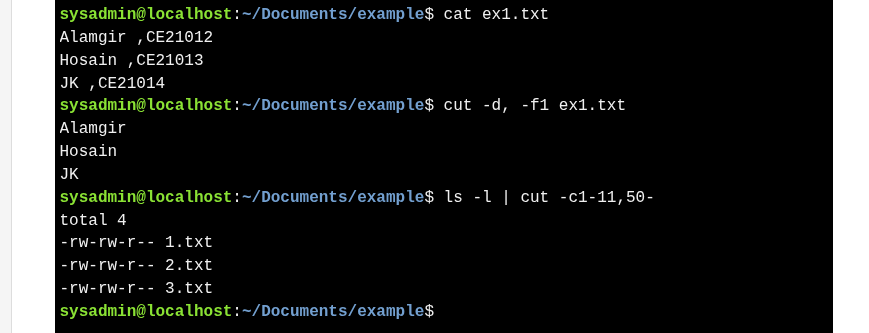

# Filtering File Section - `cut` command

* `cut` extracts **columns or sections** from a file or STDIN.
* Default delimiter is **tab**, use `-d` for custom delimiters (e.g., `:`, `,`).
    * `-f` → select **fields** (columns) by number, range, or list.
    * `-c` → select **characters** by position (for fixed-width data).

* Useful for processing **delimited files** or **command outputs**.

```bash
cut -d: -f1,5-7 mypasswd  # shows fields 1, 5, 6, 7
ls -l | cut -c1-11,50-    # shows file type, permissions, and filename
```





---
```bash
ls -l | cut -c1-11,50-
```

### Breakdown:

* `ls -l` → lists files in **long format**, showing permissions, owner, size, date, and filename.
* `|` → pipes the output of `ls -l` into `cut`.
* `cut -c1-11,50-` → extracts:

  * Characters **1-11** → file type and permissions (`drwxr-xr-x`, `-rw-r--r--`, etc.)
  * Characters **50 onward** → the **filename** (adjust number if your output width differs).

