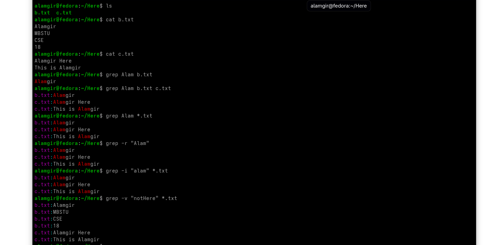

# Filtering File Content with `grep` : Global Regular Expression Print

`grep` is a text filter that searches input and returns lines containing a match to a specified pattern.

Syntax: `grep [OPTIONS] PATTERN [FILE]`


---


* `grep` → filters lines matching a **pattern** in a file or command output.
* `--color` → highlights matches.
* `-c` → shows **count** of matching lines.
* `-n` → shows **line numbers** of matches.
* `-v` → inverts match, shows lines **not matching**.
* `-i` → ignores **case**.
* `-w` → matches **whole words** only.


Examples : 

```bash
ls | grep b            # List files containing 'b'
ls | grep -i b         # List files containing 'B' or 'b' (case-insensitive)
ls | grep -E "b|c"     # List files containing 'b' or 'c'
ls | grep "^b.txt$"    # List files exactly named 'b.txt'

grep bash /etc/passwd      # lines containing 'bash'
grep "Alam" b.txt          # Search for 'Alam' inside b.txt
grep "Alam" *.txt          # Search for 'Alam' inside all .txt files

grep -r "Alam" .           # Search recursively for 'Alam' in current directory
grep -i "alam" *.txt       # Case-insensitive search for 'alam' in all .txt files
grep -v "NotHere" b.txt    # Show lines that do NOT contain 'NotHere' in b.txt
grep -w "Alamg" b.txt      # match 'are' as whole word
grep -c bash /etc/passwd   # count of lines with 'bash'
grep -n bash /etc/passwd   # lines with numbers
```



