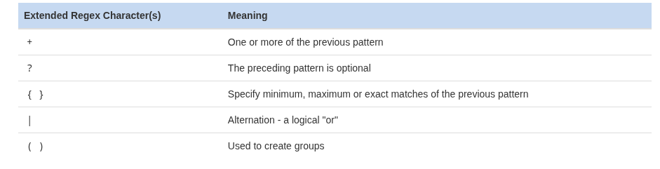

# Regular Expressions (Regex)

Regular expressions are **patterns used to match text**. They come in **two common forms**:

1. **Basic Regular Expressions (BRE)** – supported by most commands by default.
2. **Extended Regular Expressions (ERE)** – require `egrep` or `grep -E`.


## 1. Basic Regular Expressions (BRE)

| Character | Meaning                                                                           |
| --------- | --------------------------------------------------------------------------------- |
| `.`       | Matches **any single character**                                                  |
| `[ ]`     | Matches **any one of the specified characters**                                   |
| `[^ ]`    | Matches **any character except the specified ones**                               |
| `*`       | Matches **zero or more of the previous character**                                |
| `^`       | At the start: pattern must match **beginning of the line**; otherwise literal `^` |
| `$`       | At the end: pattern must match **end of the line**; otherwise literal `$`         |

---

## 2. Extended Regular Expressions (ERE)



### Example Commands

```bash
grep 'sysadmin' passwd              # Literal match: find 'sysadmin'

grep "a.b" file.txt                 # Basic: 'a' followed by any char, then 'b'
grep 'r..f' red.txt                 # . : 'r' + any 2 chars + 'f'  (reef, roof)
grep 'r..d' red.txt                 # . : 'r' + any 2 chars + 'd'  (reed, read)
grep '....' red.txt                 # . : any 4 characters

grep 'r[oe]d' red.txt               # [] : match 'rod' or 'red'
grep '[0-9]' profile.txt            # [0-9]: match any digit
grep '[^0-9]' profile.txt           # [^ ]: match non-digit characters
grep '[.]' profile.txt              # literal dot '.' inside []
 
grep 're*d' red.txt                 # * : 'r' + zero/more 'e' + 'd'
grep 'r[oe]*d' red.txt              # * : zero/more 'o' or 'e' between r and d
grep 'ee*' red.txt                  # at least one 'e' in a row

grep '^root' /etc/passwd            # ^ anchor: match lines starting with 'root'
grep 'r$' alpha-first.txt           # $ anchor: match lines ending with 'r'

grep 'pattern'                      # No filename → read from standard input
```

```bash


grep -E "ab+cd" file.txt     # Extended: 'ab' followed by 1+ 'b', then 'cd'
grep -E "ab|cd" file.txt     # Extended: matches 'ab' OR 'cd'
grep -E "a(bc)?d" file.txt   # Extended: 'bc' is optional, matches 'ad' or 'abcd'
grep -E "a{2,4}" file.txt    # Extended: 'a' repeated 2 to 4 times
```