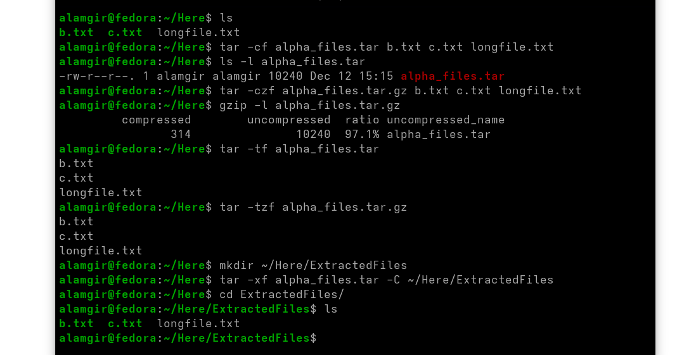

#  Archiving Files

* Archiving combines many files into one.
* `tar` is the main tool for creating these archives.
* Tar archives can be restored back into the original files.


### tar ( TApe aRchive )has three main modes:

* **Create** → make a new archive
* **Extract** → restore files from an archive
* **List** → view archive contents without extracting

>**Key idea :** Remember the mode and where to place the archive name when using `tar`.

---

## 1. Create Mode

Format : `tar -c [-f ARCHIVE] [OPTIONS] [FILE...]`

Here 
* Use `tar -c` to **create** an archive.
* Use `-f ARCHIVE` to **name** the archive file.
* Remaining arguments = files/directories to include.


**Examples:**

```bash
tar -cf alpha_files.tar alpha*      # Create tar archive
ls -l alpha_files.tar               # see long details
tar -czf alpha_files.tar.gz alpha*  # Create + gzip compress
gzip -l  alpha_files.tar.gz         # gzip Size Check

tar -cjf folders.tar.bz2 School     # Create + bzip2 compress
```
**Common options:**

* `-c` → create
* `-f` → specify archive filename
* `-z` → gzip Compress (or decompress)  (`.tar.gz` / `.tgz`)
* `-j` → bzip2 Compress (or decompress)  (`.tar.bz2` / `.tbz`)

## 2. **View the contents of a tar archive :**  `-t` command

Example :
```bash
tar -tf alpha_files.tar       # List files in uncompressed tar
tar -tzf alpha_files.tar.gz   # List files in gzip-compressed tar
tar -tjf alpha_files.tar.bz2  # List files in bzip2-compressed tar
```


## 3. Extract Mode  : `-x` command

* Use `tar -x` to **extract files** from an archive.

```bash
tar -xf ARCHIVE -C /path/to/destination      # For uncompressed tar
tar -xzf ARCHIVE -C /path/to/destination     # For gzip-compressed tar
tar -xjf ARCHIVE -C /path/to/destination     # For bzip2-compressed tar
```
Examples:

```bash
tar -xf alpha_files.tar            # Extract from uncompressed tar
tar -xzf alpha_files.tar.gz        # Extract from gzip-compressed tar
tar -xjf alpha_files.tar.bz2       # Extract from bzip2-compressed tar
```


>**Note:** Files are extracted into the **current directory** unless a path is specified.


---



**Notes:**

* Tarballs are often slightly larger before compression.
* Compressed tarballs follow naming conventions like `.tar.gz`, `.tgz`, `.tar.bz2`.

