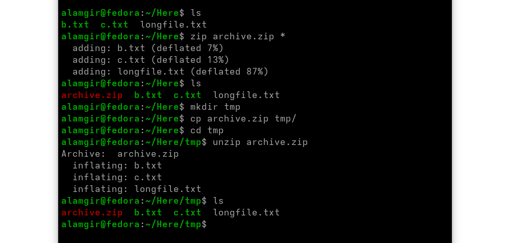

#  ZIP Files 

* **ZIP** is a common archiving format, mainly on Windows, supported in Linux via `zip` and `unzip`.
* **Default behavior:** add files and compress them.
* **Format** : `zip [OPTIONS] [zipfile [file…]]`

**Create a ZIP archive:**

```bash
zip archive.zip file1 file2 file3       # Create archive
zip -r archive.zip directory/           # Recursively add directory contents
```

* `-r` → include subdirectories
* ZIP does **not recurse by default**, unlike tar.

**List contents of a ZIP:**

```bash
unzip -l archive.zip
```

**Extract files from a ZIP:**

```bash
unzip archive.zip                       # Extract all files
unzip archive.zip path/to/file          # Extract specific file
unzip archive.zip 'dir/*pattern*'       # Extract files using wildcard
```

**Tips:**

* Extraction prompts if files already exist (`[y]es, [n]o, [A]ll, [N]one, [r]ename`).
* To avoid overwriting, extract into a **new directory**:

```bash
mkdir tmp
cp archive.zip tmp/
cd tmp
unzip archive.zip
```

>* ZIP also supports replacing files, setting compression levels, and encryption.


