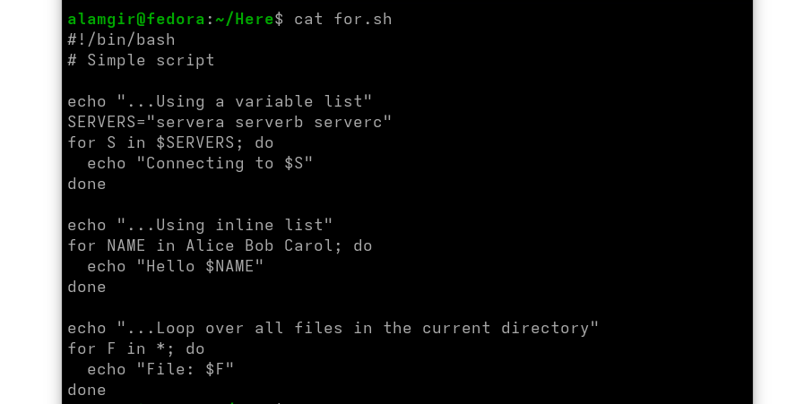
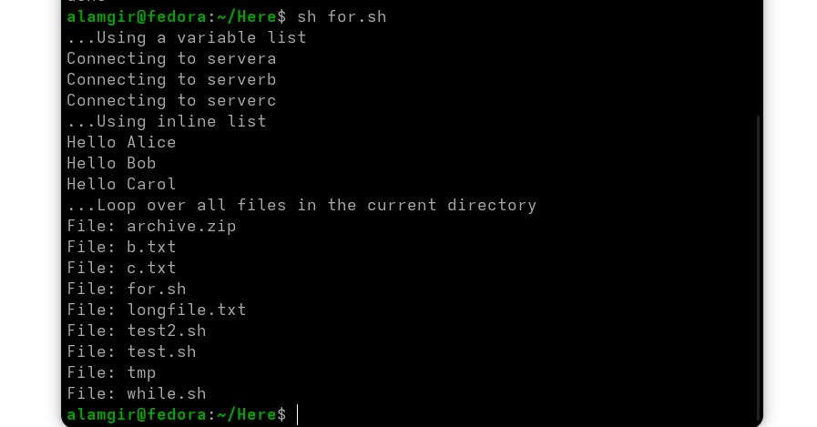
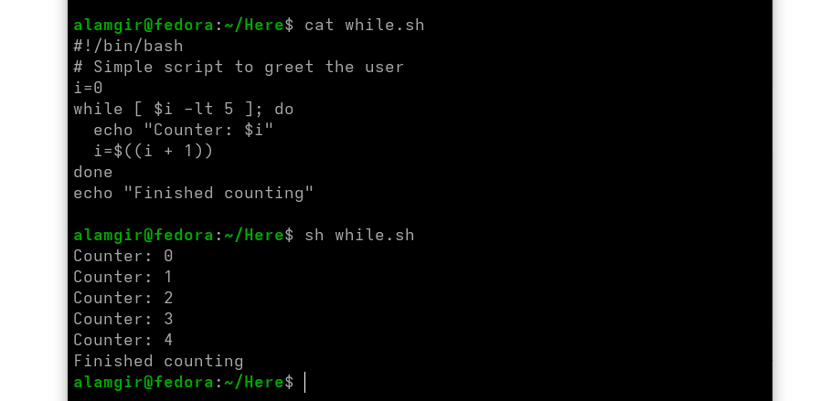

# Loops in shell scripts


### **For Loops**

* Iterate over a **finite list** of items (files, names, servers).

 Syntax:
```bash
for VAR in list; do
  commands
done
```



### **While Loops**

* Repeat commands **while a condition is true**.

Syntax:
```bash
while [ condition ]; do
  commands
done
```


 **Notes:**

* `for` is best for **known lists**.
* `while` is best for **unknown/conditional repetitions**.
* Use `$(( ))` for arithmetic operations.


