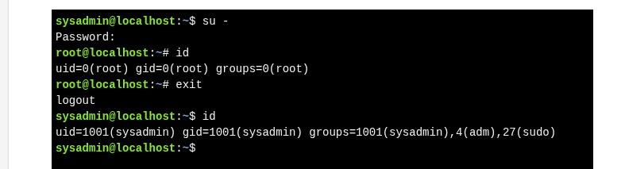
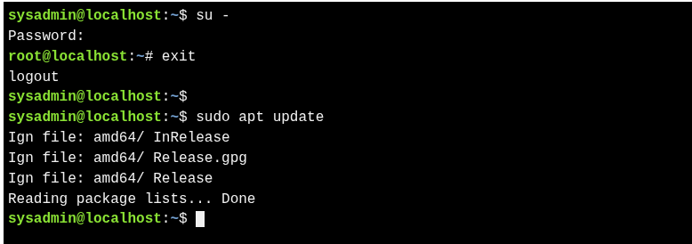

> Switching User  command : `su` 
 >**`su`** command format : `su [options] [username]`
 
 >Executing Privileged Commands : `sudo`
 >**`sudo`** command format : `sudo [options] command`

---

| Command | Example           | Explanation                                                                                                                                                          |
| ------- | ----------------- | -------------------------------------------------------------------------------------------------------------------------------------------------------------------- |
| `su`    |                   | - Switches to **another user account**, usually **root**. - Starts a **new shell**. - Requires the **target user’s password**.                                 |
|         | `su alice`        | - Switches to **user “alice”**( Requires alice’s password).                                                                                                  |
| `sudo`  |                   | - Runs a **single command** with **superuser (root) privileges**. - Does **not switch users**. - Requires **your own password**, if allowed in `/etc/sudoers`. |
|         | `sudo apt update` | - Runs the **`apt update`** command with **root privileges**.                                                                                                        |

 **Quick comparison:**

* `su` = **switch user** → full login as that user.
* `sudo` = **superuser do** → temporarily run commands as root.
* `su` starts a new shell; `sudo` runs one command at a time.

