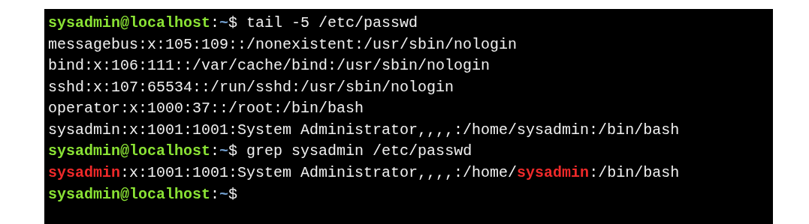
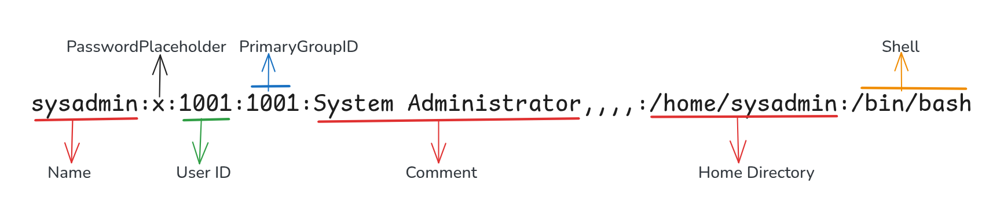

#  User Account

User account information is stored in the **`/etc/passwd`** file. Each line represents one user and fields are separated by colons (`:`)

---

### Check if a User Exists :  `grep username /etc/passwd`

Example : 

#### **Fields Description**

| Field                      | Example Value           | Description                                           |
| -------------------------- | ----------------------- | ----------------------------------------------------- |
| **Username**               | sysadmin                | Name used for login and file ownership display     |
| **Password Placeholder**   | x                       | Indicates password is stored in `/etc/shadow`       |
| **User ID (UID)**          | 1001                    | Numeric ID used internally by the system            |
| **Primary Group ID (GID)** | 1001                    | Group the user belongs to; defines group permissions |
| **Comment / GECOS**        | System Administrator,,, | Additional info about the user (e.g., full name)     |
| **Home Directory**         | /home/sysadmin          | Location of the user’s home directory                |
| **Login Shell**            | /bin/bash               | Default shell used when the user logs in             |

