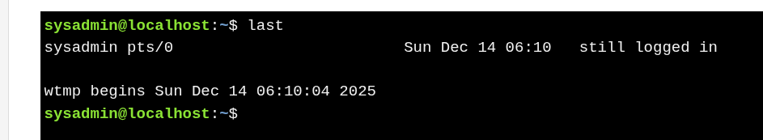

#  Viewing Login History 

* **`last`** – Shows **login and logout history** of users.
* Reads data from **`/var/log/wtmp`**.
* Displays **username, terminal, login time, logout time**, and **session duration**.
* Shows **`still logged in`** if the session is active.
* Also records **system reboots** and kernel version.

**Key Difference**

* **`who` / `w`** → Current users (reads **`/var/log/utmp`**)
* **`last`** → Login history (reads **`/var/log/wtmp`**)

