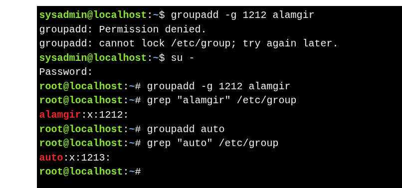

# Creating a  Group


* Use **`groupadd`** as the root user.
* Requires only the **group name**.


```bash
# Specify Group ID (GID) - Use -g to assign a custom GID
groupadd -g 1212 alamgir 

# Automatic GID Assignment
groupadd auto

#Verify Group Creation
grep auto /etc/group
```


**Key Point**
* If `-g` is not used, Linux assigns the **next available GID**.
* GIDs are auto-incremented based on existing entries in `/etc/group`.




