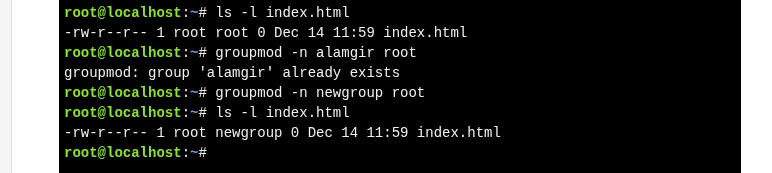

# Modifying a Group

**Command Used**

* **`groupmod`** – Modify group name or GID.

**Change Group Name**

* Option: **`-n newname oldname`**
* Changes only the **group name**, not permissions.
* Files remain accessible because ownership is based on **GID**, not name.





**Change Group ID (GID)**

* Option: **`-g GID groupname`**
* Breaks file-to-group association.
* Files become owned by a **numeric GID only** (no group name).


**Orphaned Files**

* Files owned by a GID with **no matching group name**.
* Find them using:

```bash
find / -nogroup
```

**Key Point**

* Renaming a group is safe.
* Changing a GID can cause **orphaned files** and should be done carefully.


