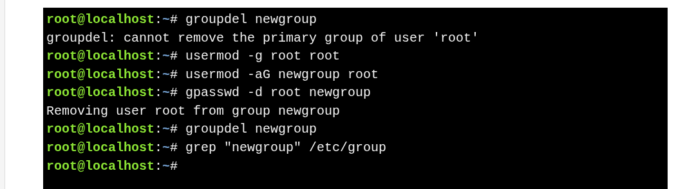

# Deleting a Group

Command :  **`groupdel groupname`** 

**Important Rules**

* Deleting a group makes its files **orphaned** (owned by GID only).
* **Primary groups cannot be deleted**.
* Only **supplemental groups** can be removed.

**How to Delete a Primary Group**

* First change users’ primary group.
* Then delete the group.

>Remember : Always check group usage before deletion to avoid orphaned files.

### **Key Notes**

* A group **cannot be deleted** if it is a **primary group** of any user.
* Use **`usermod -g`** to change the primary group.
* Use **`usermod -aG`** to add supplementary groups.
* Use **`gpasswd -d`** to remove users from supplementary groups.

✔️ This sequence ensures the delete operation works correctly and safely.

