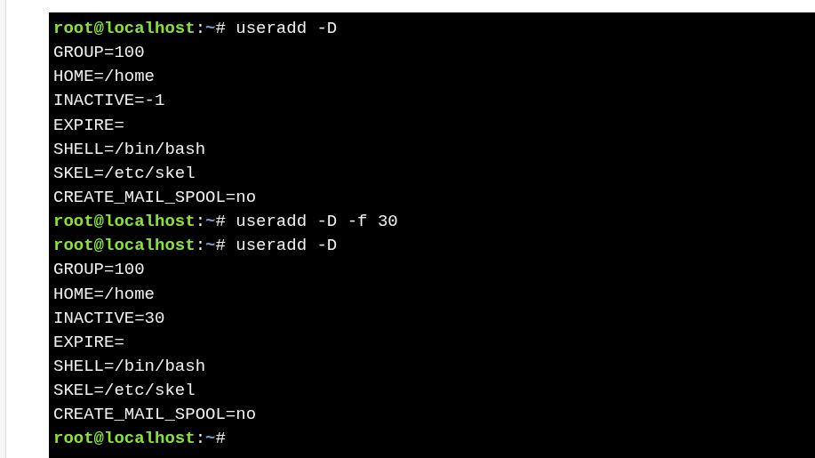
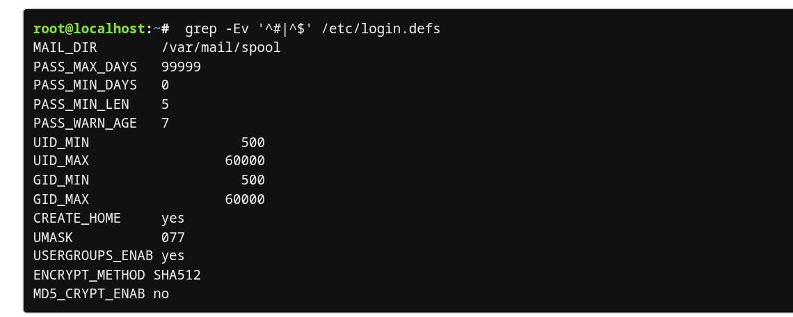

#  User Configuration Files 

* `useradd -D` shows default settings used when creating new users.
* These defaults are stored in **`/etc/default/useradd`**.
* Defaults can be viewed or changed using **`useradd -D`**.


### **Field Effects**

| File          | Affected Field                       |
| ------------- | ------------------------------------ |
| `/etc/passwd` | Primary group, home directory, shell |
| `/etc/shadow` | Inactive days, expiration date       |


---
Example : 



### **Default Values (`useradd -D`)**

| Setting           | Value     | Description                                           |
| ----------------- | --------- | ----------------------------------------------------- |
| GROUP             | 100       | Default primary group if none is specified            |
| HOME              | /home     | Base directory for user home directories              |
| INACTIVE          | -1        | Days after password expiry before account is disabled |
| EXPIRE            | (empty)   | Account expiration date (none by default)             |
| SHELL             | /bin/bash | Default login shell                                   |
| SKEL              | /etc/skel | Files copied into new user’s home directory           |
| CREATE_MAIL_SPOOL | yes       | Creates a local mail spool for the user               |


### **Related `useradd` Options**

| Option | Purpose                                 |
| ------ | --------------------------------------- |
| `-g`   | Specify primary group                   |
| `-b`   | Specify base home directory             |
| `-f`   | Set inactive days after password expiry |
| `-e`   | Set account expiration date             |
| `-s`   | Specify login shell                     |
| `-k`   | Specify skeleton directory              |


---
# User Configuration Files 

* **`/etc/login.defs`** defines default limits and policies for new users.
* It is usually edited **directly** by the administrator.
* Used by **`useradd`** when creating accounts.


### **View Active Settings**

```bash
grep -Ev '^#|^$' /etc/login.defs
```



### **Key Settings in `/etc/login.defs`**

| Setting         | Example Value   | Purpose                                |
| --------------- | --------------- | -------------------------------------- |
| MAIL_DIR        | /var/mail/spool | Location of user mail spool            |
| PASS_MAX_DAYS   | 99999           | Maximum days a password is valid       |
| PASS_MIN_DAYS   | 0               | Minimum days before password change    |
| PASS_MIN_LEN    | 5               | Minimum password length                |
| PASS_WARN_AGE   | 7               | Days before expiry to warn user        |
| UID_MIN         | 500             | Minimum UID for regular users          |
| UID_MAX         | 60000           | Maximum UID for regular users          |
| GID_MIN         | 500             | Minimum GID for regular groups         |
| GID_MAX         | 60000           | Maximum GID for regular groups         |
| CREATE_HOME     | yes             | Create home directory on user creation |
| UMASK           | 077             | Default permissions for home directory |
| USERGROUPS_ENAB | yes             | Enable User Private Groups (UPG)       |
| ENCRYPT_METHOD  | SHA512          | Password encryption method             |
| MD5_CRYPT_ENAB  | no              | Deprecated encryption option           |

