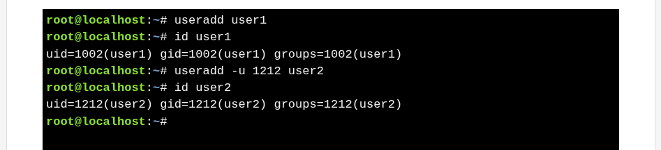
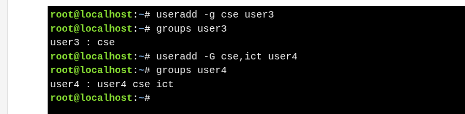
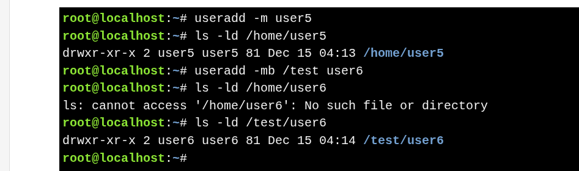

# Account Considerations

>Information to Plan Before Creating a User : Username, UID, Primary group, Supplementary groups,  Home directory,  Skeleton directory, Shell,  Comment (GECOS)

---

| Category                  | Key Points                                                                                                                                                     | Example Command                  |
| ------------------------- | -------------------------------------------------------------------------------------------------------------------------------------------------------------- | -------------------------------- |
| **Username**              | Required for `useradd`  First char: `_` or `a–z` Max: 32 (≤16 recommended) Allowed: letters, numbers, `-`, `_` Last char: not `-` Must be unique | `useradd jane`                   |
| **User Identifier (UID)** | Auto-increment by default Set manually with `-u` Recommended max: 60000 `root` UID = 0 System: 1–999 Regular users: ≥1000                       | `useradd -u 1000 jane`           |

---

| Group Type               | Description                                                                                                      | Command                          |
| ------------------------ | ---------------------------------------------------------------------------------------------------------------- | -------------------------------- |
| **Primary Group**        | Default group if not specified UPG: group auto-created Non-UPG: usually `users` (GID 100) Set with `-g` | `useradd -g users jane`          |
| **Supplementary Groups** | Extra group memberships Comma-separated list Set with `-G`                                                 | `useradd -G sales,research jane` |

---

| Item                   | Description                                                                                                                                                   | Command                                                                        |
| ---------------------- | ------------------------------------------------------------------------------------------------------------------------------------------------------------- | ------------------------------------------------------------------------------ |
| **Home Directory**     | Default: `/home/username` Created automatically if enabled  Controlled by  `/etc/default/useradd` and    `/etc/login.defs`  Options : `-m` create home `-M` do not create home `-b` set base directory `-d` set full path | `useradd -m jane` `useradd -mb /test jane` `useradd -md /test/jane jane` |
| **Skeleton Directory** | Default: `/etc/skel` Files copied to home `-k` set custom skeleton Requires `-m`                                                                     | `useradd -mk /home/sysadmin jane`                                              |

---
| Item                | Description                                                                                            | Command                      |
| ------------------- | ------------------------------------------------------------------------------------------------------ | ---------------------------- |
| **Shell**           | Default from `/etc/default/useradd` Override with `-s` System accounts often use `/sbin/nologin` | `useradd -s /bin/bash jane`  |
| **Comment (GECOS)** | Usually full name Shown by login managers Set with `-c`                                          | `useradd -c "Jane Doe" jane` |
