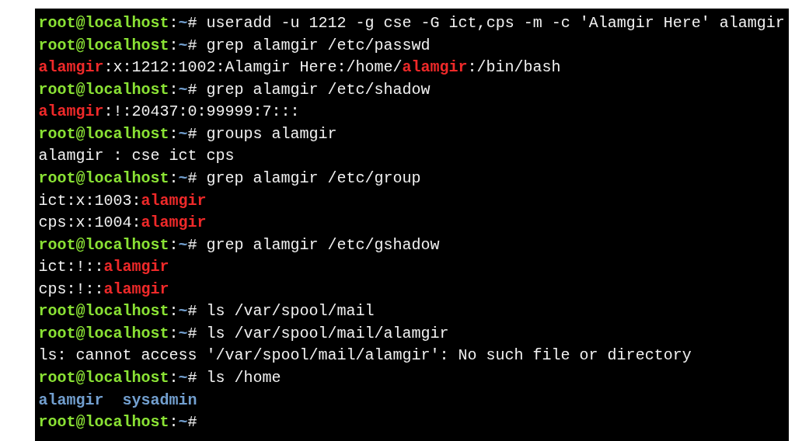

# Creating a User
```bash
useradd -u 1212 -g cse -G ict,cps -m -c 'Alamgir Here' alamgir
```


**Explanation:**

| Option              | Purpose                            |
| ------------------- | ---------------------------------- |
| `-u 1212`           | Set UID to 1212                    |
| `-g cse`          | Set primary group                  |
| `-G ict,cps` | Assign supplementary groups        |
| `-m`                | Create home directory `/home/alamgir` |
| `-c 'Alamgir Here'`     | Set comment/full name              |

---

### **What happens after creation**

* **User files updated automatically:**

  * `/etc/passwd` – basic account info
  * `/etc/shadow` – password info (account has no valid password yet)
  * `groups groupname` – List groups for a user
  * `/etc/group` – supplementary group membership
  * `/etc/gshadow` – group password info

---

* **Mail spool:** If `CREATE_MAIL_SPOOL=yes`, `/var/spool/mail/alamgir` is created.

* **Home directory created with restricted permissions** and skeleton files copied from `/etc/skel`.
