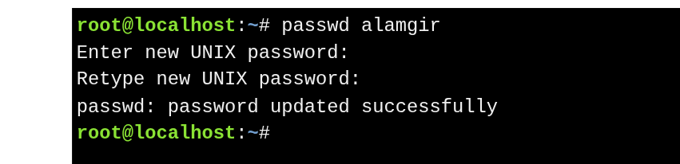
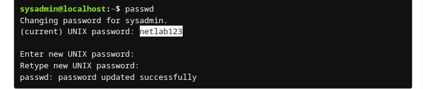

# Updating User Passwords


The `passwd` command is used to update a user’s password.

* Users can change **their own passwords**.
* The **root user** can change any user’s password.

Syntax : `passwd [OPTIONS] [USER]`



### **Change  Own Password**

```bash
passwd
```




### **View Password Status**

```bash
passwd -S sysadmin
```


**Output Fields:**

| Field           | Example    | Meaning                                  |
| --------------- | ---------- | ---------------------------------------- |
| User Name       | sysadmin   | Name of the user                         |
| Password Status | P          |P indicates a usable password.<br>L indicates a locked password.<br>NP indicates no password. |
| Change Date     | 12/09/2015 | Last password change date                |
| Minimum         | 0          | Min days before password can be changed  |
| Maximum         | 99999      | Max days before password expires         |
| Warn            | 7          | Days before expiry to warn user          |
| Inactive        | -1         | Days account remains active after expiry |


---


#  Managing Password Aging

The **`chage`** command manages password aging using information from `/etc/shadow`.

### **Common Options**

| Short Option     | Long Option                | Description                                  |
| ---------------- | -------------------------- | -------------------------------------------- |
| `-l`             | `--list`                   | Show account aging info                      |
| `-d LAST_DAY`    | `--lastday LAST_DAY`       | Set last password change date                |
| `-E EXPIRE_DATE` | `--expiredate EXPIRE_DATE` | Set account expiration date                  |
| `-h`             | `--help`                   | Display help                                 |
| `-I INACTIVE`    | `--inactive INACTIVE`      | Days allowed to login after password expires |
| `-m MIN_DAYS`    | `--mindays MIN_DAYS`       | Minimum days before password can change      |
| `-M MAX_DAYS`    | `--maxdays MAX_DAYS`       | Maximum days before password must change     |
| `-W WARN_DAYS`   | `--warndays WARN_DAYS`     | Days before expiration to warn user          |

