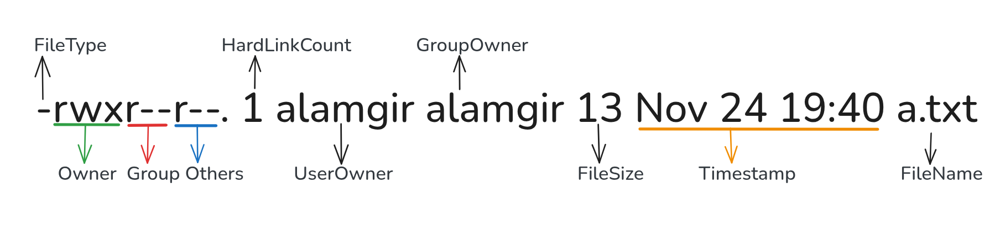

# Understanding File Permission

To check file permissions, use
```bash
ls -l filename
```
Output 
```bash
-rwxr--r--. 1 alamgir alamgir 13 Nov 24 19:40 a.txt
```
---




<h3>1. File Type</h3>

| Symbol | File Type      | Short Meaning                    | Example             |           
| ------ | -------------- | -------------------------------- | ------------------- | 
| `d`    | Directory      | Stores other files               | `/home`             |           |
| `-`    | Regular file   | Normal file (text, image, etc.)  | `data.txt`          |           |
| `l`    | Symbolic link  | Points to another file           | `link -> file.txt`  |           |
| `s`    | Socket         | Process communication            | Used by web servers |           |
| `p`    | Pipe           | Data stream between processes    | `ls                  grep txt` 
| `b`    | Block file     | Hardware device (storage)        | `/dev/sda`          |           |
| `c`    | Character file | Hardware device (keyboard, etc.) | `/dev/tty`          |           |

<h3>2. Permissions</h3>

>Permissions show how different users can access and use a file.


| Permission Field  | Explanation                                                                                                                             |
| ---------------- | -------------------------------------------------------------------------------------------------------------------------------------- |
| **Owner (User)** | - Applies if current account is **file owner**.<br> - Others’ permissions **do not apply**.              |
| **Group**        |  - Applies if **not owner** but **member of group**.<br>- Owner and others’ permissions **do not apply** |
| **Other**        | - Applies if **neither owner nor in group**.<br>- Owner and group permissions **do not apply**.                                        |


| Permission  Type    | File Effect                                   | Directory Effect                                               |
| --------------- | --------------------------------------------- | -------------------------------------------------------------- |
| **read (r)**    | Read or copy file contents                    | List files (non-detailed without `x`, detailed with `x`)       |
| **write (w)**   | Modify or overwrite file contents             | Add or remove files (requires `x`)                             |
| **execute (x)** | Run file as a process (needs `r` for scripts) | Enter/change to directory (requires `x` on parent directories) |


>* Files need **r/w/x** for content access or execution.
>* Directories need **x** to access contents, **w** to modify contents, **r** to list contents.


<br>

3.**Hard Link Count** : This value shows how many hard links point to this file.
4. **Owner** :  When a file is created, ownership is automatically assigned to the user who created it.
5. **Group Owner** : Shows which group owns this file.  
6. **File Size** :  Size of the file /directory  in bytes.
7. **Timestamp** : This indicates when the file contents were last changed.
8. **Directory / File Name**: Name of the directory or file


---


| Part               | Meaning                                                                                                                                     |
| ------------------ | ------------------------------------------------------------------------------------------------------------------------------------------- |
| **`-`**            | Indicates a **regular file** (not a directory or special file).                                                                             |
| **`rwx`**          | **Owner (alamgir) permissions:**<br>- `r` → read<br>- `w` → write<br>- `x` → execute<br>**These permissions apply only to the file owner.** |
| **`r--`**          | **Group (alamgir) permissions:**<br>- `r` → read only<br>**No write or execute permission for group members.**                              |
| **`r--`**          | **Others (everyone else) permissions:**<br>- `r` → read only<br>**No write or execute permission.**                                         |
| `.`   | SELinux security context is enabled   |
| **`alamgir`**      | User owner of the file.                                                                                                                     |
| **`alamgir`**      | Group owner of the file.                                                                                                                    |
| **`13`**           | File size in bytes.                                                                                                                         |
| **`Nov 24 19:40`** | Last modification date and time.                                                                                                            |
| **`a.txt`**        | File name.                                                                                                                                  |


