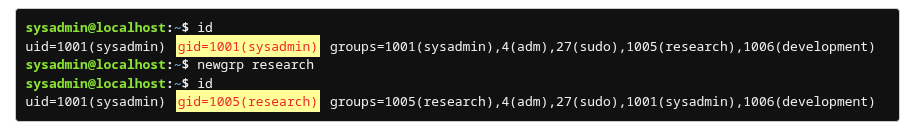
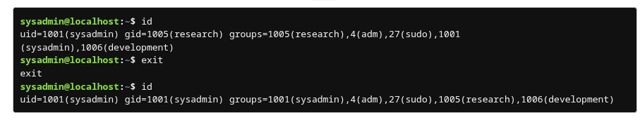

#  Changing Groups

### **Switching Primary Group Temporarily**

* **Command:** `newgrp group_name` – Change current primary group in the active shell.
* Verify the change with `id`.
    

* Files created in the new shell will belong to the new primary group:

    

* To revert to the original primary group, **exit the new shell**:

    

### **Changing Primary Group Permanently**

* Requires **administrative privileges**.
* **Command:** `usermod -g groupname username`

### **Checking Group Membership**

* `groups` – Show all groups a user belongs to.
* `id` – Show UID, GID, and all group memberships (more detailed).

