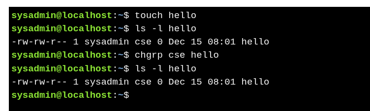
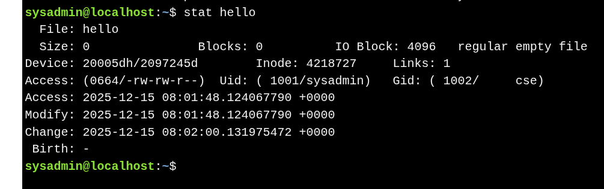

#  Changing Group Ownership

### **Changing Group of a File**

* **Command:** `chgrp group_name file` – Change the group owner of a file.
* **Permissions:**

  * **Root:** Can change any file’s group.
  * **Regular user:** Can only change files they own to groups they belong to.

**Example:**


* **Error if not permitted:**

```bash
chgrp development /etc/passwd
# chgrp: changing group of '/etc/passwd': Operation not permitted
```


### **Changing Group Recursively**

* Use `-R` to change the group of a directory and all its contents:

```bash
chgrp -R development test_dir
```


### **Viewing Ownership**

* `ls -l file` – Shows basic ownership and permissions.
* `stat file` – Shows detailed ownership info including UID, GID, and timestamps.

**Example:**



