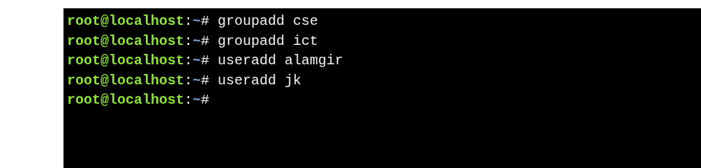
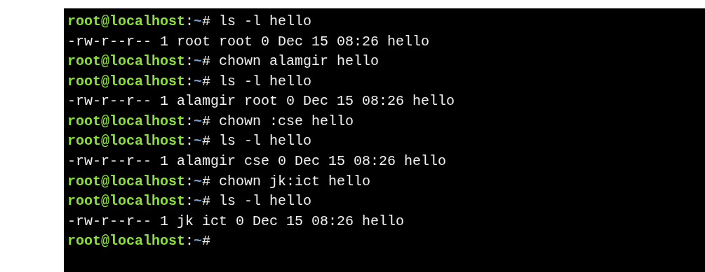

#  **Changing File Ownership**

### **About `chown`**

* **`chown`** changes **file owner (user)** and/or **group ownership**.
* **Root user:**

  * Can change user and group ownership of any file.
* **Regular user:**

  * Cannot change user ownership.
  * Can change **group ownership** only to groups they belong to.

### **Key Notes**

* Changing **user ownership** always requires **root**.
* Changing **group ownership**:

  * Root → any group
  * Regular user → only own groups

---


### **Syntax**

```bash
chown [OPTIONS] [OWNER] FILE
```

* **`OWNER`** → new user who will own the file.
* **`FILE`** → file or directory whose ownership is being changed.
* **OPTIONS** → modify how `chown` works. Common options include:

| Option             | Meaning                                                                                    |
| ------------------ | ------------------------------------------------------------------------------------------ |
| `-R`               | **Recursive** → apply ownership change to all files and subdirectories inside a directory. |
| `-v`               | **Verbose** → show what is being changed.                                                  |
| `-c`               | **Report only changed files** → only outputs if ownership was actually modified.           |
| `--dereference`    | Affect the target of symbolic links (default behavior).                                    |
| `--no-dereference` | Affect the symlink itself, not its target.                                                 |


### **Examples**

```bash
chown newuser filename  # Change owner
chown :newgroup filename  # Change group
chown newuser:newgroup filename  # Change owner and group
```






