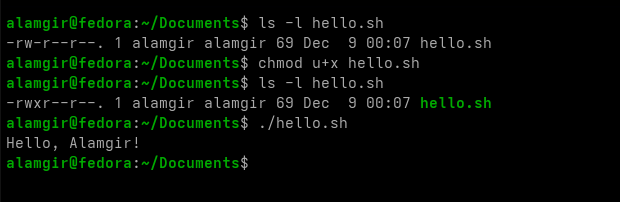

# **Changing File Permissions**

>The `chmod` command **changes permissions** of a file or directory. Only the **file owner** or **root user** can change permissions.


###  Why is the command named `chmod` instead of `chperm`?

Permissions used to be referred to as **modes of access**, so the command `chmod` really means change the modes of access.

---

There are **two methods** to change file or directory permissions:

1. **Symbolic Method**

   * Good for **changing one set of permissions at a time**.
   * Uses symbols like `u` (user), `g` (group), `o` (other) and `+`, `-`, `=`.
   * Example: `chmod u+x file.sh` → **add execute permission for owner**.

2. **Octal (Numeric) Method**

   * Uses **octal values** for permissions (`r=4`, `w=2`, `x=1`).
   * Requires specifying **all three sets** (user, group, other) at once.
   * Requires understanding **octal values for each permission**.

* Example: `chmod 754 file.sh`

  * `7 (rwx)` → user,`5 (r-x)` → group, `4 (r--)` → others
  
```bash
chmod 755 filename  # User (rwx), Group (r-x), Others (r-x)
chmod 644 filename  # User (rw-), Group (r--), Others (r--)
chmod 700 filename  # User (rwx), No access for others
```


>* Use **symbolic** for small, targeted changes.
>* Use **octal** for **full permission setup**.

<br>

Here is the **permission value table**

| Number | Permission | Meaning              |
| -----: | :--------: | -------------------- |
|      7 |    `rwx`   | Read, Write, Execute |
|      6 |    `rw-`   | Read, Write          |
|      5 |    `r-x`   | Read, Execute        |
|      4 |    `r--`   | Read only            |
|      3 |    `-wx`   | Write, Execute       |
|      2 |    `-w-`   | Write only           |
|      1 |    `--x`   | Execute only         |
|      0 |    `---`   | No permissions       |


---
```bash
chmod [<SET><ACTION><PERMISSIONS>]... FILE
```

- **1. Permission Sets : < SET >**

    - User(`u`),Group(`g`),Others(`o`),All(`a`)

- **2. Action Symbols : < ACTION>**

    -  Modify permissions using symbols:  Add (`+`), remove (`-`), or set (`=`) permissions.

- **3. Permissions < PERMISSIONS>**
    - Read(`r`),Write(`w`),Execute(`x`)
    
    
Example :   

```bash
chmod u+x filename  # Add execute for user
chmod g-w filename  # Remove write for group
chmod o=r filename  # Set read-only for others
chmod u=rwx,g=rx,o= filename  # Set full access for user, read/execute for group, and no access for others
```  





