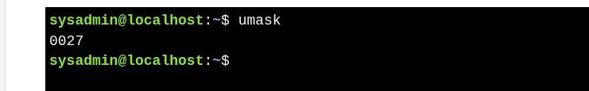
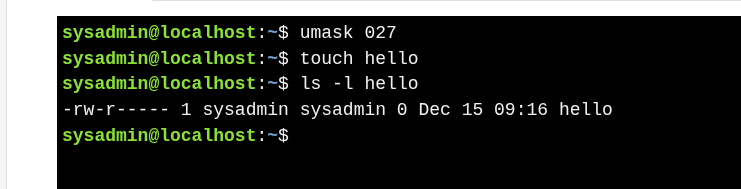
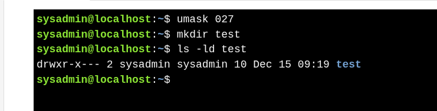

# Default Permissions (umask)

### **What is umask?**

* Determines **default permissions** for newly created files and directories.
* Default permissions = **max permissions -  umask**.
* Maximum default permissions:

  | Type      | Max Permissions   |
  | --------- | ----------------- |
  | File      | `rw-rw-rw-` (666) |
  | Directory | `rwxrwxrwx` (777) |

### **Check Current umask**

**Breakdown of 0027:**

* First `0`: octal number

* Second `0`: subtract from **user**

* Third `2`: subtract from **group**

* Fourth `7`: subtract from **others**

---

### **Example: File Permissions**

* Assume `umask = 027`
* Default file permissions = 666
* Resulting permissions = 666 - 027 = 640 → `rw-r-----`

---

### **Example: Directory Permissions**

* Assume `umask = 027`
* Default directory permissions = 777
* Resulting permissions = 777 - 027 = 750 → `rwxr-x---`

---

### **Important Notes**

* **Umask applies only to new files/directories in the current session.**
* To make it **permanent**, modify the user's `.bashrc` in their home directory.

