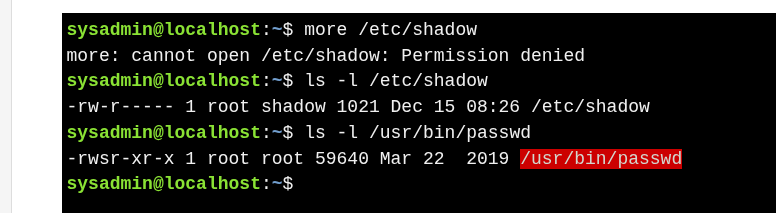

# Setuid

* When **setuid** is set on an executable, the program runs **with the permissions of the file owner**, not the user executing it.
* Commonly used for **system utilities** like `passwd`, allowing normal users to perform actions requiring root privileges.

### **Example**

* Normal users cannot access `/etc/shadow`.
* `passwd` modifies `/etc/shadow` because it has **setuid** set.
* **`s` in owner execute** → setuid is active
  * **Lowercase `s`** → setuid + execute
  * **Uppercase `S`** → setuid only, no execute

## **Managing Setuid**

* **Symbolic method:**

    * Add setuid: `chmod u+s file`
    * Remove setuid: `chmod u-s file`

* **Octal method:**

    * Add setuid: `chmod 4775 file` (existing 775 + 4000)
    * Remove setuid: `chmod 0775 file` (subtract 4000)

>* Four-digit octal codes are required to set special permissions.
>* Using three digits can **remove existing special permissions**.
