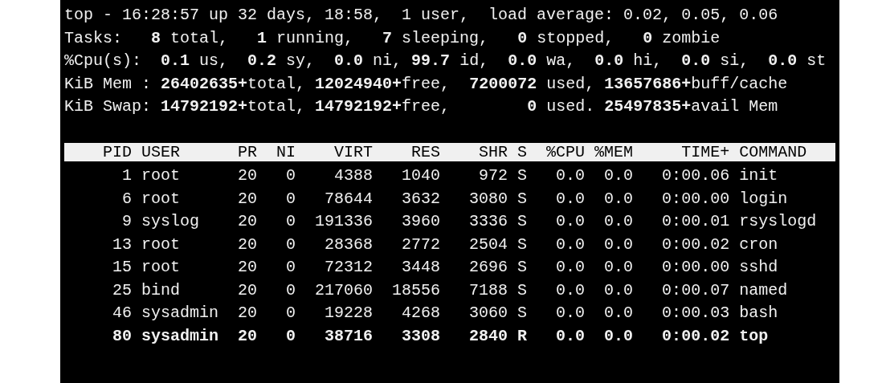

# Viewing Processes in Real Time : `top` command



An administrator that is running the top command can then take one of two actions:

| Key | Action            | Description                                                                                 |
| --- | ----------------- | ------------------------------------------------------------------------------------------- |
| K   | Terminate process | Terminate a selected process by PID and signal number            |
| R   | Adjust priority   | Adjust priority (niceness) of a process |


---
### The top command shows overall system load and trends over time
```bash
cat /proc/loadavg
# 0.12 0.46 0.25 1/254 3052
```
Here,
| Field     | Value | Description                                       |
| --------- | ----- | ------------------------------------------------- |
| Load Average     | 0.12  | Load average over the last 1 minute               |
| Load Average     | 0.46  | Load average over the last 5 minutes              |
| Load Average     | 0.25  | Load average over the last 15 minutes             |
| Number of Processes | 1/254 | 1 process currently running / 254 total processes |
| Last PID  | 3052  | Last process ID that executed on the CPU          |
