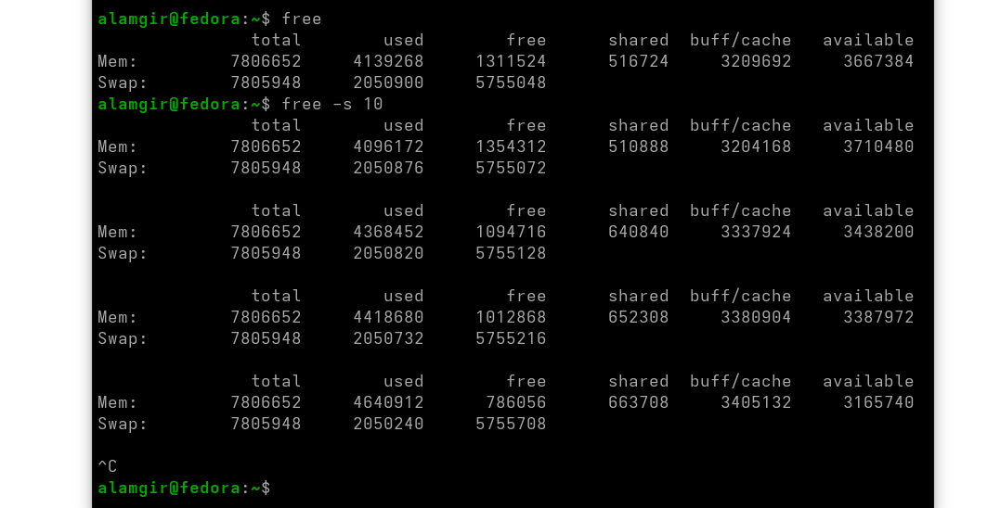

# Memory 

* Linux uses virtual memory to share RAM among processes.
* Virtual addressing lets multiple processes use the same memory without conflicts.
* Memory is divided into addressable blocks, which can be local or remote.

## Viewing Memory

```bash
free       # Shows current memory and swap usage snapshot.
free -s 10 # Updates memory usage every 10 seconds.
free -m    # Displays memory usage in megabytes.
free -g    # Displays memory usage in gigabytes.
```

