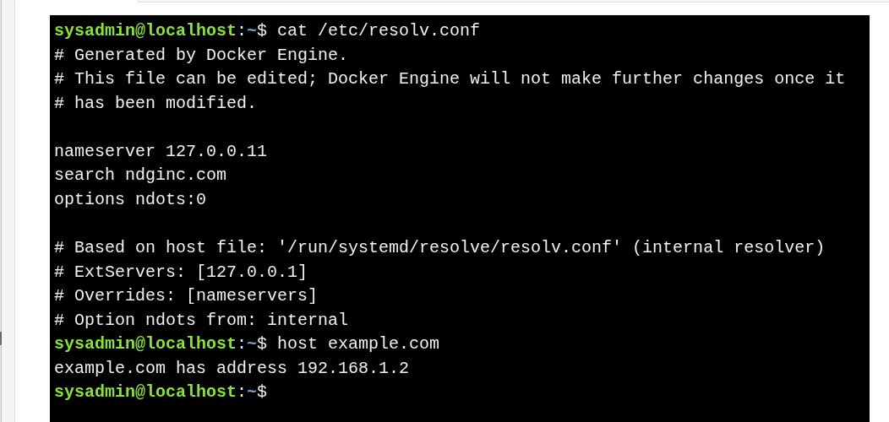

# Domain Name System (DNS)
 
 >Computers use **DNS** to translate website names (e.g., `www.example.com`) into **IP addresses**.If the IP address is unknown, the system queries a **DNS server**.The **DNS server address** is usually received automatically via **DHCP**.
* DNS server details are stored in the file: **`/etc/resolv.conf`**
* The **`host` command** is used to resolve a hostname to an IP address
* Example of a typical DNS configuration: `nameserver 127.0.0.1`
    * The **`nameserver`** entry specifies which DNS server to use.
    * Multiple **nameserver** entries can exist to provide **backup DNS servers** if one fails.

