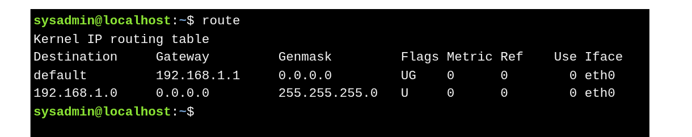
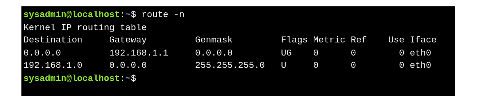

# The `route` Command

* A **router (gateway)** connects different networks and directs network traffic.
* The **`route` command** displays the **kernel IP routing table**, showing where packets are sent.

Example : 

* **192.168.1.0** → Local network; packets sent **directly** (* no gateway).
* **default / 0.0.0.0** → All other destinations; packets sent to **router** at `192.168.1.1`.

### Numeric View

* Use `-n` to show **IP addresses only**:

* **0.0.0.0** = default route (all other machines).

---

# Modern Replacement

* `route` is **deprecated** in many Linux distributions.
* Use **`ip route show`** instead:

* `default via 192.168.1.254` → router for all external traffic.
* `192.168.1.0/24` → local network, directly reachable.

