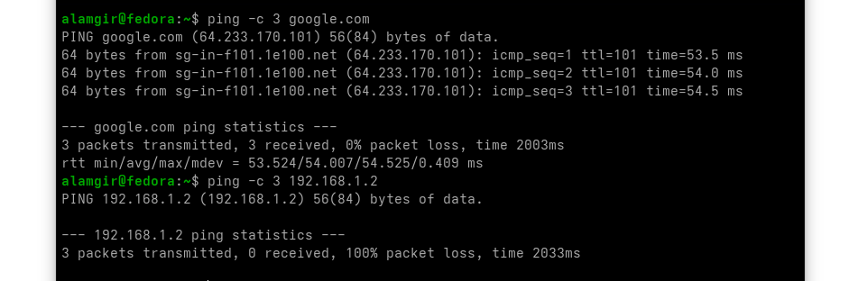

## **Ping — Test Network Connectivity**

The `ping` command checks if another machine is reachable over the network.

* Sends packets (ICMP Echo Request)
* Requires an IP address or hostname
* Continues until **Ctrl + C**
* Use `-c` to l**imit number of packets**


Example:

```bash
ping -c 3 google.com
ping -c 3 192.168.1.2
```

Output shows:



|  Case| Explanation                                                                                                                             |
| ---------------- | -------------------------------------------------------------------------------------------------------------------------------------- |
| **Why ping may fail?** | - Device is offline.<br> - Wrong IP address .  <br> - System or network configured to **block ping** for security          |
| **Ping Hostnames**        | - ping domain names: `ping -c 3 google.com`<br> - DNS is working.<br>- Network connection is active.<br> - Remote server reachable |


