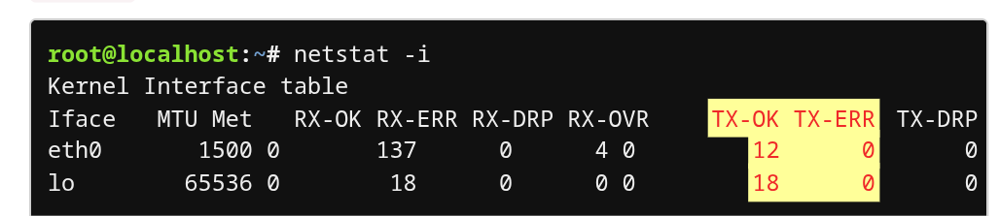
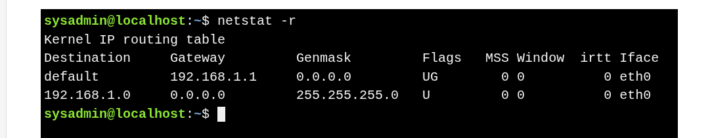
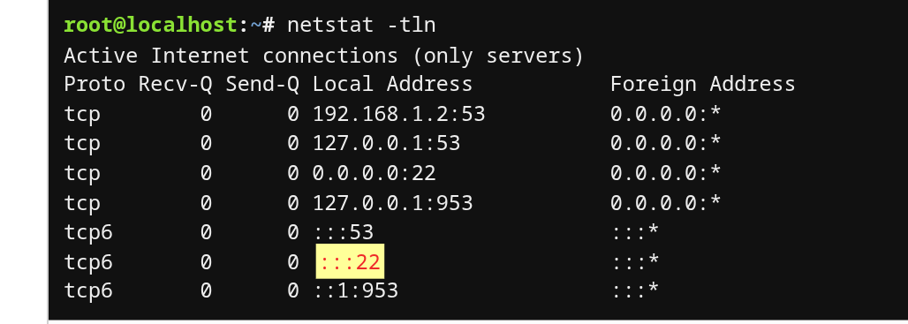
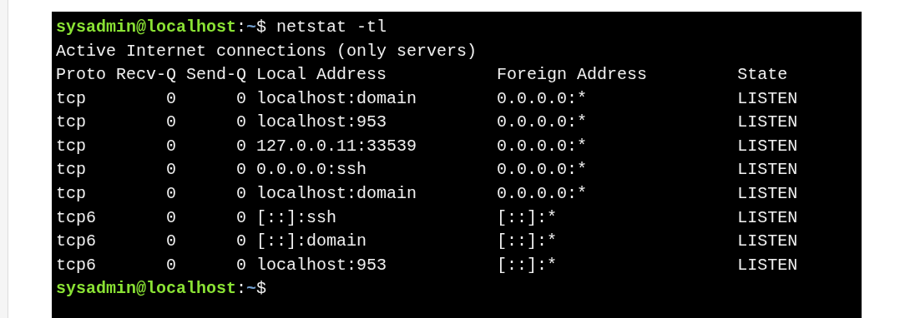

#  The `netstat` Command

> Displays **network connections, routing tables, interface stats, and open ports**.

 

* **Interface stats:** `netstat -i`
  * Shows RX/TX packets and errors.
  * **TX-ERR** high → possible network issues.

* **Routing table:** `netstat -r`

  * Similar to `route`; shows where packets are sent.

* **Open ports (listening services):**  `netstat -tln`

  * `-t` → TCP, `-l` → listening, `-n` → numeric addresses.
  * Example: port #22 is listening, which means it is open.

* **Show names instead of numbers:** `netstat -tl`
  

---
* **Notes:**

  * `netstat` is **obsolete** in many distributions.
  * Replacements:

    * `ss` → network connections
    * `ip route` → routing table
    * `ip -s link` → interface stats
    * `ip maddr` → multicast addresses

