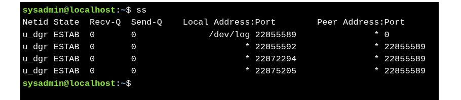
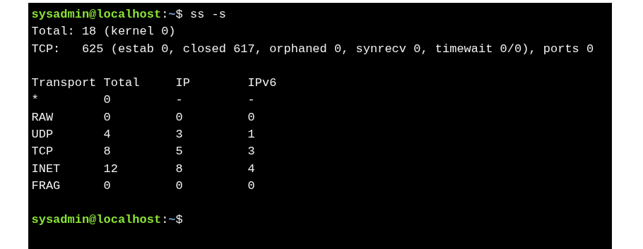

#  The `ss` Command

* **Purpose:** Displays **socket statistics**, connections, and network info.
* **Replacement:** Modern alternative to `netstat` with more features.
* **Use case:** View **established connections**, statistics, and socket types.

---

### Basic Usage : `ss`

* Shows all current socket connections.

| Column        | Description                            |
| ------------- | -------------------------------------- |
| Netid         | Socket type and transport protocol     |
| State         | Connection state (e.g., ESTAB, LISTEN) |
| Recv-Q        | Data queued to be received             |
| Send-Q        | Data queued to be sent                 |
| Local Address | Local host address and port            |
| Peer Address  | Remote host address and port           |

---

### Socket Statistics : `ss -s`

* Displays **summary of socket types** and statistics.

---
>* Pipe output to `less` for easier viewing: `ss | less`
>* Most common exam-level usage: **`ss`** for connections, **`ss -s`** for summary.
