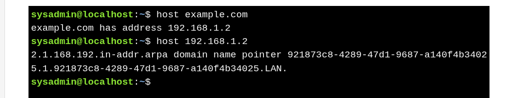

# The `host` Command

* **Purpose:** Performs **DNS lookups** to associate **hostnames with IP addresses** and vice versa.
* **Basic Usage:** : `host example.com`
* **Reverse Lookup**
    * If the IP address is known: `host 192.168.1.2`

#### **Query Specific DNS Records**

| Option         | Description                     | Example                     |
| -------------- | ------------------------------- | --------------------------- |
| `-t CNAME`     | Check canonical name (alias)    | `host -t CNAME example.com` |
| `-t SOA`       | Check Start of Authority record | `host -t SOA example.com`   |
| `-a` or `-all` | Retrieve all DNS information    | `host -a example.com`       |

---

> `host` is simpler than `dig` for **quick DNS lookups**, including reverse and specific record queries.
